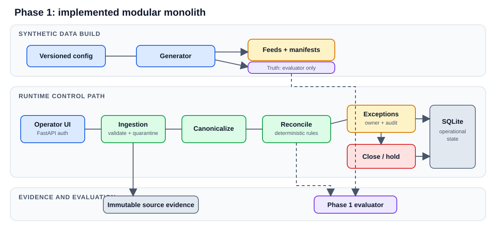

# Co-lending Control Tower

A deterministic control for reconciling synthetic originator, LMS, and bank
feeds. It preserves source evidence, routes breaks to an owned queue, and produces
an auditable `CLOSE` or `HOLD` decision.

Phase 1 is implemented as a Python modular monolith with FastAPI, SQLAlchemy,
SQLite, and a Preact UI. Phase 2 is design-only.

## Run locally

Requirements: Python 3.10+, [`uv`](https://docs.astral.sh/uv/), and Git.

```bash
uv sync
cp .env.example .env
set -a && . ./.env && set +a
uv run alembic upgrade head
uv run control-tower-generate
uv run control-tower-web
```

Open <http://127.0.0.1:8000>. Choose an Operations or Approver role. Generated
feeds are under `generated/development`; local state and evidence are under
`evidence/`.

The application does not load `.env` automatically, so export it in every new
shell before starting the server.

## Workflow

1. Ingest the three generated feeds and validate their manifests.
2. Canonicalize accepted records without losing source lineage.
3. Reconcile using exact, composite, timing, and explicit break rules.
4. Investigate exceptions and record reasons in the audit trail.
5. Approve resolutions with the Approver role.
6. Calculate a reproducible close decision and inspect its blockers.

Money is stored as integer paise. Runtime reconciliation never reads generator
truth and never uses fuzzy or AI matching.

## Architecture



[Edit the draw.io source](docs/diagrams/phase1-architecture.drawio) or read the
[full system design](docs/SYSTEM_DESIGN.md), which includes the proposed Phase 2
scale design, consistency model, SLOs, security, rollout, rollback, and costs.

## Evaluation

Run development and fresh-seed evaluation in isolated databases:

```bash
uv run control-tower-evaluate
```

Reports are written to:

```text
generated/evaluation/development/scorecard.json
generated/evaluation/fresh-seed/scorecard.json
generated/evaluation/summary.json
```

Verified result:

| Gate | Result |
| --- | ---: |
| Truth classifications | 4,000 / 4,000 |
| Exact matches | 3,520 |
| Composite matches | 80 |
| Straight-through rate | 90% |
| False matches / exposure | 0 / INR 0 |
| Exception coverage | 100% |
| Control-total difference | 0 records / INR 0 |

The same revision was verified from a clean worktree with locked dependencies,
Alembic migration, the two-seed evaluator, all tests, and a production UI build.

## Verify

```bash
uv run --with ruff ruff check src tests migrations
uv run pytest
uv run alembic check
```

To rebuild the committed frontend bundle:

```bash
cd frontend
npm ci
npm run format:check
npm run build
```

## Key assumptions

- Data is synthetic and currency is INR.
- Originator is intent, bank is fund movement, and LMS is loan creation.
- Amount tolerance is zero; composite groups must balance exactly.
- The operating timezone is `+05:30`, cutoff is 18:00, and grace is 120 minutes.
- Timing differences remain pending and separate from confirmed exceptions.
- Unresolved value has zero close tolerance; pending exposure is policy-bounded.

Policies live in `config/`. Source contracts, state definitions, lineage, matching
order, ownership, and close equations are documented in
[`docs/SYSTEM_DESIGN.md`](docs/SYSTEM_DESIGN.md).

## Limitations

- SQLite, local filesystem evidence, static demo tokens, and one server process.
- Fixed CSV contracts; no partner schema registry or streaming ingestion.
- No production identity provider, telemetry stack, HA, or disaster recovery.
- **Restart full pipeline** drops local operational tables. It is a demo reset,
  not a production restart or rollback mechanism.
- Bulk selected resolution is a time-boxed demo convenience, not a production
  maker-checker process.

## AI disclosure

OpenAI OpenCode assisted with README generation and the final review. The
application itself has no AI dependency: matching, workflow, and close decisions
are deterministic rules.

## Reference

- [System design and Phase 2 proposal](docs/SYSTEM_DESIGN.md)
- [Implementation roadmap](docs/ROADMAP.md)
- API documentation at <http://127.0.0.1:8000/docs> while the server is running
