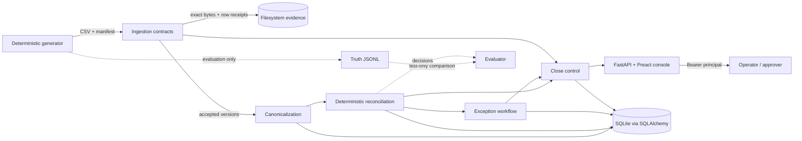

# Co-lending Control Tower

Evidence-first ingestion, deterministic reconciliation, owned exception workflow,
and reproducible close control for synthetic co-lending data.

**Submission status:** Phase 1 is implemented as a local modular monolith. Phase 2
is a design proposal only. This repository contains no runtime AI or OpenAI API
integration.

## What is implemented

- Deterministic generation of synthetic originator, LMS, and bank CSV feeds,
  manifests, isolated evaluation truth, and a quality report.
- Contract validation, manifest controls, row quarantine, immutable
  content-addressed evidence, replay detection, and changed-payload conflicts.
- Canonical source events with raw-record lineage and integer-paise money values.
- Versioned exact, documented composite, timing, and exception classifications.
- Persisted exception ownership, SLA, maker-checker actions, and audit history.
- Reproducible `CLOSE` or `HOLD` decisions over an explicit reconciliation and
  ingestion scope.
- Authenticated FastAPI endpoints and a bundled Preact operator console.

This is an assessment/demo implementation, not a production deployment. See
[System design](docs/SYSTEM_DESIGN.md), [roadmap](docs/ROADMAP.md), and the
[12-minute demo script](docs/DEMO_SCRIPT.md).

## Clean setup

Prerequisites: Git, Python 3.10 or newer, and
[`uv`](https://docs.astral.sh/uv/). Node.js/npm are needed only when rebuilding
the frontend; the compiled UI is committed in the Python package.

From a clean checkout at the repository root:

```bash
uv sync
cp .env.example .env
set -a
. ./.env
set +a
uv run alembic upgrade head
uv run control-tower-generate
uv run control-tower-web
```

Open <http://127.0.0.1:8000>. The generated data directory entered in the UI is
`development`, relative to `CONTROL_TOWER_INPUT_ROOT=generated`. API reference is
available while the server runs at <http://127.0.0.1:8000/docs>.

The shell export step is required because the application does not load `.env`
itself. Stop the server with `Ctrl-C`. Local state is retained in
`evidence/ingestion.db`; received artifacts are retained below
`evidence/artifacts/`.

### Frontend development

The backend serves the committed build in `src/control_tower/web/ui/dist`. After
changing `frontend/src`, rebuild it with:

```bash
cd frontend
npm ci
npm run build
```

Use `npm run dev` only for Vite development. The normal demo uses
`uv run control-tower-web`.

## Commands

```bash
# Generate the default deterministic dataset
uv run control-tower-generate

# Generate a separate fresh-seed dataset
uv run control-tower-generate --seed 987654 --output generated/evaluation

# Apply/check database migrations
uv run alembic upgrade head
uv run alembic check

# Start API and bundled UI
uv run control-tower-web

# Run all automated checks available in this checkout
uv run --with ruff ruff check src tests migrations
uv run pytest

# Rebuild/check the UI
cd frontend && npm ci && npm run build && npm run format:check
```

## Evaluation

The intended submission command is:

```bash
uv run control-tower-evaluate
```

The command evaluates both configured scenarios (`development_seed=20260908` and
`fresh_seed=987654`) in isolated output directories. It generates, ingests,
canonicalizes, reconciles, creates exceptions, calculates close, compares runtime
decisions with generator truth, writes each scenario's `scorecard.json`, and exits
non-zero if a release gate fails.

Observed on 2026-09-11:

```text
instruction_count: 4000
correct_count: 4000
composite_match.count: 80
exact_match.count: 3520
straight_through_rate: 0.9
false_match_count: 0
false_match_exposure_paise: 0
exception_coverage.count_rate: 1.0
exception_coverage.value_rate: 1.0
control_total_count_difference: 0
control_total_value_difference_paise: 0
failed_case_count: 0
passed: true
```

The same committed revision was verified from an isolated clean Git worktree with
`uv sync --locked`, Alembic upgrade, the two-seed evaluator, 60 tests, `npm ci`,
Prettier, and the production Vite build. npm reported zero vulnerabilities.

The CLI prints the complete result as JSON; the fields above are an abridged,
human-readable transcription. It reported two scenarios and scorecards at
`generated/evaluation/development/scorecard.json` and
`generated/evaluation/fresh-seed/scorecard.json`. Focused automated coverage can
also be run with:

```bash
uv run pytest tests/reconciliation/test_fresh_seed_evaluation.py \
  tests/close_control/test_fresh_seed_close.py -q
```

Observed on 2026-09-11 with seed `987654`:

```text
..                                                                       [100%]
2 passed in 11.71s
```

Those focused assertions prove 2,000/2,000 fresh-seed truth classifications, 40
composite matches, zero false deterministic matches, zero false-match paise,
complete count/value accounting, and a persisted `HOLD` with unresolved blockers.
Truth is read only by evaluation after matching; runtime reconciliation cannot
read `truth/classifications.jsonl`.

## Phase 1 architecture



Phase 1 is one process and one relational transaction boundary. SQLite stores
local operational state; the filesystem stores immutable raw evidence. Alembic
owns schema upgrades. This avoids distributed partial failures while preserving
module boundaries for a future deployment. Detailed invariants, failure modes,
and the proposed Phase 2 topology are in [System design](docs/SYSTEM_DESIGN.md).

## Assumptions and state definitions

Business assumptions:

- All supplied and generated records are synthetic; do not load real customer
  data into this local assessment build.
- Currency is exactly `INR`; money is positive integer paise, never float.
- Source timestamps are timezone-aware. Canonical cutoff is configured as
  `18:00:00` at `+05:30`.
- Originator instruction is expected intent, bank settlement is movement of
  funds, and LMS booking is creation of the loan record.
- Phase 1 amount tolerance is zero. Composite matching requires a documented
  reference and exact sum; arbitrary subset-sum and fuzzy matching are excluded.
- A timing difference is non-blocking/pending only within the configured
  120-minute grace window.

Operational states:

| Area | States/meaning |
| --- | --- |
| Ingestion row | `ACCEPTED` is eligible; `QUARANTINED` is preserved but excluded; a repeated identity/payload is a replay; changed payload under one identity is `CONFLICT` and blocked. |
| Canonical status | `READY`, `SUCCESS`, `PENDING`, `FAILED`, `REVERSED`, or `CANCELLED`; source status is retained separately. |
| Reconciliation | `EXACT_MATCH`, `COMPOSITE_MATCH`, `TIMING_DIFFERENCE`, `DUPLICATE_EVENT`, `AMOUNT_MISMATCH`, `STATUS_MISMATCH`, `MISSING_EVENT`, or `UNRESOLVED`. |
| Exception | `OPEN` -> `INVESTIGATING` -> `PENDING_APPROVAL` -> `RESOLVED`; rejection returns to investigation and changed evidence can produce `REOPENED`. |
| Close | `CLOSE` only when policy allows the persisted scorecard; otherwise `HOLD`. Repeating the same snapshot and policy returns `REPLAY`. |

## Source contracts and lineage

Every CSV has an exact ordered header. Every source requires `partner_code`,
`batch_id`, `currency=INR`, and a timezone-aware `received_timestamp`.

| Source | Identity | Correlation/reference | Amount | Event timestamp | Allowed status |
| --- | --- | --- | --- | --- | --- |
| Originator | `instruction_id` | `loan_reference`; also requires `customer_surrogate_id` | `amount_paise` | `instruction_timestamp` | `APPROVED`, `REJECTED`, `CANCELLED` |
| LMS | `booking_id` | `partner_loan_reference`; also requires `internal_loan_id` | `booked_amount_paise` | `booking_timestamp` | `BOOKED`, `PENDING`, `FAILED`, `REVERSED` |
| Bank | `transaction_reference` | `linked_instruction_reference`; optional `reversal_reference` | `debit_amount_paise` | `value_timestamp` | `SETTLED`, `PENDING`, `FAILED`, `REVERSED` |

Each manifest controls SHA-256, row count, and amount total. Exact received bytes
are published at
`evidence/artifacts/<source>/<artifact_sha256>/source.csv`; `records.jsonl`
records line location, payload hash, validation state, and errors; `receipt.json`
records delivery controls. Canonical provenance carries `source_version_id`,
payload hash, artifact hash, and `#line=` source location. Reconciliation stores
the source-version IDs, rule version, reason, and snapshot-derived run key. Close
stores reconciliation/ingestion scope, policy version, snapshot hash, ordered
blockers, actor, and deterministic decision hash.

## Configuration

| File or variable | Purpose/current value |
| --- | --- |
| `config/generator.json` | Seed `20260908`, 2,000 instructions, three partners/days, amounts and disjoint anomaly rates. |
| `config/evaluation.json` | Development/fresh seeds, isolated output root, and policy/config paths used by `control-tower-evaluate`. |
| `config/canonicalization.json` | Canonical timezone `+05:30` and cutoff `18:00:00`. |
| `config/reconciliation.json` | Rule version `phase1-v1`; 120-minute grace. |
| `config/exceptions.json` | Per-class owner/action/escalation/SLA and P1/P2 paise thresholds. |
| `config/close_control.json` | Policy `phase1-close-v1`, zero unresolved tolerance, INR 10 crore pending limit, quarantine/control failures block. |
| `CONTROL_TOWER_DATABASE_URL` | SQLAlchemy URL; example is local SQLite `sqlite:///evidence/ingestion.db`. |
| `CONTROL_TOWER_EVIDENCE_ROOT` | Artifact root; defaults to `evidence`. |
| `CONTROL_TOWER_INPUT_ROOT` | Only root the ingestion/restart API may read; example is `generated`. |
| `CONTROL_TOWER_IDENTITIES_JSON` | Server-side token to actor/role map. Tokens are credentials, not actor IDs supplied by requests. |

Configuration is loaded when the relevant operation runs; restart the server
after changing environment variables. Policy/config changes intentionally alter
run or decision identity.

## Demo

1. Complete clean setup and start the server.
2. Open <http://127.0.0.1:8000> and authenticate with the example operator token
   `operator-demo` only in this local synthetic demo.
3. Enter `development`, ingest, reconcile, inspect scorecards and source-linked
   exception evidence, then investigate and request resolution.
4. Switch to `approver-demo`, approve/reject an item, and calculate close to show
   role enforcement, audit history, and `HOLD` blockers.
5. Follow [docs/DEMO_SCRIPT.md](docs/DEMO_SCRIPT.md) for the timed recording.

The recording script and checklist are prepared, but the narrated video must be
recorded and reviewed by the submitter; no video file is generated by this project.

**Destructive warning:** the UI/API **Restart** action is a local demo reset. It
requires the approver role, drops all operational database tables, recreates
them, and reruns ingest through close. It does not delete content-addressed files,
but it destroys local database history and must not be treated as a production
restart mechanism.

**Demo-convenience warning:** **Resolve selected** lets an approver bulk-resolve
selected exceptions directly. It is implemented to fit the demo timebox and
bypasses the normal per-item investigate/request/approve journey. It is not an
acceptable production control for financial exceptions.

## Security and privacy

Implemented controls include server-derived actor/role, bearer authentication on
all `/api` routes, operator/approver authorization, maker-checker checks for
material overrides, ingestion path containment, immutable evidence conventions,
hash lineage, and append-only action behavior at the application layer.

Limitations: example bearer tokens are static and transmitted over plain local
HTTP; there is no OIDC, TLS termination, secret manager, database row-level
security, malware scanning, field encryption, automated retention/deletion,
tenant isolation, or production-grade audit immutability. The runtime database
role is not restricted to insert-only audit access in local SQLite. Do not expose
this server publicly or use production PII. Production requires TLS, managed
identity and secrets, least-privilege PostgreSQL roles, encrypted/versioned object
storage, network policy, auditable retention/legal-hold/deletion, and log
redaction. See the [Phase 2 security/privacy design](docs/SYSTEM_DESIGN.md#security-privacy-and-ai-safeguards-proposed).

## Limitations

- Local single-process server, SQLite database, and local filesystem evidence;
  no high availability, workers, queue, or object storage.
- CSV-only fixed contracts and one global policy set; no partner schema registry.
- Deterministic reference-based matching only; no fuzzy/probabilistic recovery.
- Evaluation uses synthetic ground truth and has not been calibrated against real
  partner data or independently validated production labels.
- UI bulk resolution and destructive restart are demo conveniences, not
  production workflows.
- No load/performance, chaos, browser E2E, accessibility certification, backup
  restore, disaster recovery, or penetration test evidence.
- Close scope is selected reconciliation and ingestion run keys rather than a
  production business-date/partner completeness ledger.

## Development-assistance disclosure

OpenAI OpenCode was used as a development assistant for parts of this repository,
including code/documentation drafting, repository inspection, and test execution.
The project owner remains responsible for review, correctness, and submission.
There is **no runtime AI**: the application makes no OpenAI or other model API
calls, sends no source/customer data to a model, and all matching, exception, and
close decisions are deterministic application rules. Phase 2 AI ideas are
optional decision support only and are not implemented.

## Links

- [Detailed system design and Phase 2 proposal](docs/SYSTEM_DESIGN.md)
- [Timed demo and recording checklist](docs/DEMO_SCRIPT.md)
- [Implementation roadmap/status](docs/ROADMAP.md)
- [FastAPI interactive API docs](http://127.0.0.1:8000/docs) when running locally
- [`uv` installation documentation](https://docs.astral.sh/uv/getting-started/installation/)
