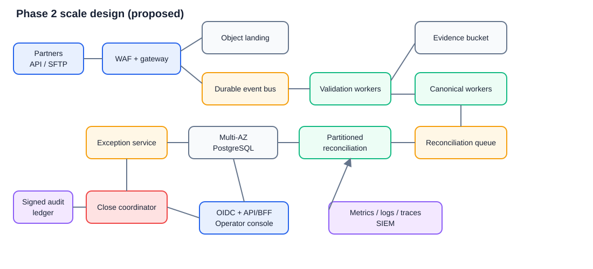

# System design

This document labels current behavior as **Implemented (Phase 1)** and future
work as **Proposed (Phase 2)**. Proposed controls, SLOs, scale, and cost figures
are design targets, not measured production claims.

## Problem and assumptions

One disbursement appears in three systems: originator intent, bank movement, and
LMS booking. Deliveries differ in schema and timing. The control tower must show
what evidence arrived, what fails to reconcile (including INR exposure), who owns
the work, and whether a selected scope may close without forcing uncertain
records together.

Phase 1 assumes synthetic data, INR integer paise, offset-aware timestamps,
`+05:30` operating time, zero amount tolerance, exact/documented-composite
matching, and a 120-minute grace window. Originator is expected intent, bank is
fund movement, and LMS is loan creation. These are assessment assumptions, not
validated partner contracts.

## Phase 1 architecture (implemented)

Editable draw.io source: [`diagrams/phase1-architecture.drawio`](diagrams/phase1-architecture.drawio).

Modules under `src/control_tower/` own generator, ingestion, canonical,
reconciliation, exceptions, close control, and web responsibilities. Operational
records share one relational transaction boundary. Raw source bytes stay outside
the database. Local evidence publication uses a temporary directory followed by
atomic `os.replace`; a duplicate artifact hash reuses the existing evidence.

### Implemented flow and invariants

1. Generator creates deterministic source records, manifests, quality report,
   and isolated truth. One event receives one primary anomaly label.
2. Ingestion verifies exact header, fields, hash, row count, and total. Artifact
   failures preserve evidence then reject; row failures quarantine only that row.
3. Registry identity is `(source, batch_id, source_record_id)`. Same payload is a
   replay; changed payload appends a version and creates a persistent conflict.
4. Accepted source versions map to canonical events while retaining artifact,
   payload, source-version, and line-location provenance.
5. Reconciliation orders duplicate, documented composite, exact, missing,
   contradictory status, amount mismatch, grace timing, then unresolved. A source
   record cannot be consumed twice.
6. Blocking outcomes create policy-owned exceptions. Actions capture actor, role,
   reason, time, and before/after state; changed evidence can reopen work.
7. Close uses one persisted reconciliation run and its explicitly selected
   ingestion run. It stores policy/snapshot identity, complete accounting,
   blockers, and deterministic decision hash.

Source bytes are immutable; quarantined data cannot canonicalize; truth is not a
runtime input; every canonical event points to one source version; every accepted
instruction value is matched, pending, or unresolved; resolving an exception
does not rewrite its deterministic classification; identical snapshot/config/rule
inputs reproduce the same result.

### Implemented consistency and retries

- Reconciliation run and memberships commit in one database transaction.
- Snapshot, normalized policy, and rule version form deterministic run identity;
  unchanged reruns return `REPLAY`.
- Incomplete evidence directories are not published. Retry requires the original
  source feed.
- Exception synchronization is idempotent for unchanged decisions and refreshes
  or reopens on changed evidence.
- Close sorts blockers before hashing and returns the stored result for identical
  scope and policy.
- Process restart retains SQLite and evidence. The UI action named **Restart** is
  different: it destructively drops/recreates all local database tables before
  rebuilding the demo journey. It must never be used as a production pattern.
- Bulk selected resolution is an approver-only demo convenience that skips the
  normal item-by-item maker-checker journey; it is not a production design.

### Implemented failure boundaries

Malformed rows are quarantined; undecodable files, wrong headers, and failed
manifest controls reject the artifact after preserving what arrived. A process
failure before atomic evidence publication leaves no visible final artifact.
SQLite and local files mean host loss, disk exhaustion, corruption, or concurrent
multi-host operation are not adequately addressed in Phase 1.

## Phase 2 scale design (proposed)

### Scale assumptions

Capacity must be validated with real partner forecasts. Initial sizing assumes
50 partners, 10 million source rows/day, 3-5 KB compressed evidence per row,
business-day peaks of 2,000 rows/s, 10x burst headroom at ingress, 400 concurrent
operators, seven-year evidence/audit retention subject to legal review, and one
regional deployment with multi-AZ resilience. Reconciliation is micro-batched by
tenant/partner/business date; financial close remains an explicit bounded scope.

### Proposed components

Editable draw.io source: [`diagrams/phase2-scale.drawio`](diagrams/phase2-scale.drawio).

Object storage is the source-byte system of record; PostgreSQL owns identities,
lineage, policies, decisions, workflow, and close scope. A durable bus decouples
arrival from processing. Workers partition by tenant/partner/business date and
autoscale. The close coordinator reads a completeness ledger and a repeatable
database snapshot, not caller-selected arbitrary receipts. A signed/WORM audit
export provides independent tamper evidence.

### Consistency model

- Strong consistency is required for source identity/version registration,
  match membership uniqueness, exception transitions, approvals, completeness
  seals, and final close publication.
- Evidence upload completes and its SHA-256 is verified before metadata is made
  eligible. Object keys are immutable and versioning/object lock is enabled.
- Bus delivery is at least once. Consumers use inbox tables and idempotency keys;
  producer transactions use an outbox/change-data-capture pattern.
- Canonical and reconciliation outputs are immutable versions. Corrections append
  new source/snapshot versions and supersede rather than mutate decisions.
- Close acquires a scope lock, verifies all expected feeds and worker watermarks,
  reads one repeatable snapshot, and atomically publishes decision plus outbox.
- Read models and dashboards may be eventually consistent; UI displays watermark
  and freshness. They cannot authorize close.

### Proposed SLOs

| Measure | Target | Window/condition |
| --- | ---: | --- |
| API availability | 99.9% monthly | Excludes planned maintenance; mutating API |
| Accepted-feed durability | 99.999999999% | Object-store design target, not an app guarantee |
| Ingestion acknowledgement | p95 < 5 s | After durable landing for files <= 100 MB |
| Validation/canonicalization freshness | 99% < 10 min | From complete upload at normal load |
| Reconciliation freshness | 99% < 20 min | From all required source feeds/watermark |
| Operator reads | p95 < 1 s | Filtered queue/summary requests |
| Close calculation | p95 < 60 s | <= 10 million source rows in sealed scope |
| RPO / RTO | <= 5 min / <= 60 min | Regional database failure; quarterly restore test |

Correctness gates override latency: stale/incomplete/ambiguous scope produces
`HOLD`, never a guessed `CLOSE`. Error-budget exhaustion freezes non-critical
rollouts and triggers capacity/correctness review.

### Monitoring and alerting

Instrument OpenTelemetry traces and structured, redacted logs with tenant,
partner, batch, run, snapshot, policy, and correlation IDs, never raw customer
fields or bearer tokens. Metrics cover delivery age, expected-vs-received files,
hash/control failures, quarantine/conflict rates, queue age/depth, worker retry and
dead-letter counts, reconciliation outcome/value distribution, false-match canary
results, unmatched exposure, overdue exception value, close HOLD reason/value,
database lag/locks, object errors, API latency/error rate, and auth denials.

Page on missed completeness cutoff, unexplained money conservation violation,
duplicate source consumption, close inconsistency, data-loss signal, security
event, or SLO burn. Ticket slower partner-quality drift and capacity trends.
Dashboards must separate event count from INR exposure. Synthetic canaries run
known truth through production rules without mixing truth into runtime matching.

### Retries and poison data

Clients send an artifact checksum and idempotency key. Retry transient network,
429, and 5xx failures with exponential backoff, full jitter, bounded attempts,
and server `Retry-After`; never retry deterministic contract/auth failures without
correction. Consumers acknowledge only after transactional inbox processing.
Poison messages enter a dead-letter queue with evidence pointers and alerting,
not raw PII. Operators can replay from a reviewed checkpoint; replay preserves
the original payload and creates a new processing attempt, not a new source fact.
Circuit breakers protect dependencies. Reconciliation and close remain safe to
retry through stable scope/snapshot/policy idempotency keys.

### Rollout and rollback

1. Version source schemas, canonical mappings, match rules, exception policy, and
   close policy independently; migrations use expand/migrate/contract.
2. Replay a sanitized historical corpus and synthetic truth in CI, then shadow
   new rules against production snapshots without affecting workflow/close.
3. Compare count/value conservation and per-class deltas; require finance, risk,
   engineering, security, and privacy approval for material changes.
4. Canary by internal tenant, then 1%, 10%, 25%, 50%, and 100%, with hold periods
   and automatic stop thresholds for errors, latency, or classification drift.
5. Keep old rule workers and schemas readable through the rollback window.

Rollback routes new scopes to the prior immutable version and replays from the
last safe watermark. Never delete new evidence or rewrite decisions already used
for close. If a bad rule contributed to a published close, freeze affected scopes,
issue a superseding decision with incident linkage, notify control owners, and
retain both results. Database rollback uses forward-compatible code first and a
forward fix; destructive down-migrations are not the default.

### Security, privacy, and AI safeguards (proposed)

- OIDC/SAML SSO, short-lived tokens, MFA for approvers, scoped service identities,
  tenant-aware authorization, segregation of duties, and periodic access review.
- TLS/mTLS in transit; KMS envelope encryption at rest with tenant/context-bound
  keys; secrets manager with rotation; private networks, egress deny-by-default,
  WAF, malware scanning, signed artifacts/images, SBOM, dependency/container
  scanning, patch SLAs, and penetration testing.
- Database roles enforce least privilege. Audit tables are insert-only to runtime;
  signed daily roots export to WORM storage. Break-glass access is time-bound,
  approved, and alerted.
- Minimize collection to reconciliation fields; tokenize customer identifiers;
  keep PII out of logs/metrics/non-production; classify fields; document purpose,
  residency, retention, legal hold, subject-request/deletion exceptions, and
  processor agreements. Backups inherit deletion/expiry policy.
- This repository has no runtime AI. If Phase 2 introduces AI, it may only
  summarize evidence or recommend investigation steps. It cannot match, resolve,
  approve, or close; deterministic controls remain authoritative.
- AI inputs use allowlisted/minimized fields, redaction, regional no-training
  contracts, encryption, prompt-injection-resistant rendering, tool egress
  restrictions, and no direct database mutation. Outputs are labeled, cited to
  evidence, logged with model/prompt version, confidence, and human disposition.
- Offline evaluation covers hallucination, bias across partners, leakage,
  adversarial input, and regression. Low confidence, missing citation, provider
  outage, drift, or policy breach fails closed to the normal human queue. A kill
  switch removes AI without changing ingestion, reconciliation, exceptions, or
  close.

### Estimated monthly cost

Directional 2026 USD estimate for the stated 10-million-row/day, single-region,
multi-AZ assumption; cloud/provider, discounts, retention, and actual bytes can
change it materially. Excludes staff, tax, support plans, data egress, and DR in a
second active region.

| Component | Estimate/month | Basis |
| --- | ---: | --- |
| Kubernetes/serverless compute | $4,000-$10,000 | API plus burstable validation/reconciliation workers |
| Multi-AZ PostgreSQL + IOPS/backups | $4,000-$12,000 | HA primary/read capacity; biggest workload uncertainty |
| Object evidence/archive | $2,000-$8,000 | Roughly 30-150 TB retained with lifecycle tiers |
| Managed event bus | $1,000-$4,000 | About 300M source-row events/month, batching assumed |
| Observability/SIEM | $2,000-$8,000 | Aggressive log sampling/redaction required |
| WAF, KMS, secrets, network, registry | $1,000-$3,000 | Baseline managed security/platform services |
| Optional AI | $0 by default; cap $500 | Disabled runtime; only approved, sampled summaries if introduced |
| **Total** | **$14,000-$45,000/month** | Before staff, support, egress, and second-region DR |

A 30-day representative load test, retention forecast, query plan, and vendor
calculator are required before budget approval. Storage lifecycle, batched bus
messages, queue-driven autoscaling, metric cardinality limits, and sampled logs
are the main cost controls.

## Current open questions

- Which partner-specific contracts, final statuses, correction identities, and
  delivery completeness signals are authoritative?
- Which quarantines and override values are material, and who may approve them?
- What are contractual cutoff, SLO, retention, residency, legal-hold, RPO, and RTO
  requirements?
- Should close scope be partner/business-date/entity, and how are late files or
  downstream reversals represented after close?
- What measured peak volume, row size, concurrency, and evidence retrieval rate
  should replace the Phase 2 sizing assumptions?
